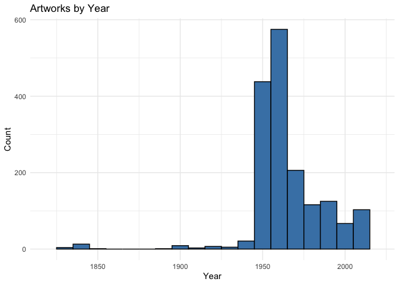

Lab 08 - University of Edinburgh Art Collection
================
Yuxin Xie
3/3/2025

## Load Packages and Data

First, let’s load the necessary packages:

``` r
library(tidyverse) 
#install.packages("skimr")
library(skimr)
library(ggplot2)
library(dplyr)
```

Now, load the dataset. If your data isn’t ready yet, you can leave
`eval = FALSE` for now and update it when needed.

``` r
# Remove eval = FALSE or set it to TRUE once data is ready to be loaded
uoe_art <- read_csv("data/uoe-art.csv")
```

## Exercise 9

\##Let’s start working with the **title** column by separating the title
and the date:

``` r
uoe_art2 <- uoe_art %>%
  separate(title, into = c("title", "date"), sep = "\\(") %>%
  mutate(year = str_remove(date, "\\)") %>% as.numeric()) %>%
  select(title, artist, year, link)  
```

    ## Warning: Expected 2 pieces. Additional pieces discarded in 47 rows [72, 109, 114, 145,
    ## 418, 431, 537, 584, 710, 810, 835, 861, 879, 943, 1004, 1062, 1203, 1244, 1249,
    ## 1311, ...].

    ## Warning: Expected 2 pieces. Missing pieces filled with `NA` in 697 rows [6, 12, 18, 23,
    ## 31, 44, 54, 58, 59, 60, 62, 66, 71, 78, 82, 83, 87, 90, 91, 95, ...].

    ## Warning: There was 1 warning in `mutate()`.
    ## ℹ In argument: `year = str_remove(date, "\\)") %>% as.numeric()`.
    ## Caused by warning in `str_remove(date, "\\)") %>% as.numeric()`:
    ## ! NAs introduced by coercion

## Exercise 10

get some errors, Some title values don’t contain (, so date is assigned
NA. Some title values contain multiple (, and separate() keeps only the
first split. Some date values don’t just contain valid years (e.g.,
“circa 1890” or “Unknown”) and as.numeric() converts them to NA.

## Exercise 11

``` r
skim(uoe_art2)
```

|                                                  |          |
|:-------------------------------------------------|:---------|
| Name                                             | uoe_art2 |
| Number of rows                                   | 3320     |
| Number of columns                                | 4        |
| \_\_\_\_\_\_\_\_\_\_\_\_\_\_\_\_\_\_\_\_\_\_\_   |          |
| Column type frequency:                           |          |
| character                                        | 3        |
| numeric                                          | 1        |
| \_\_\_\_\_\_\_\_\_\_\_\_\_\_\_\_\_\_\_\_\_\_\_\_ |          |
| Group variables                                  | None     |

Data summary

**Variable type: character**

| skim_variable | n_missing | complete_rate | min | max | empty | n_unique | whitespace |
|:--------------|----------:|--------------:|----:|----:|------:|---------:|-----------:|
| title         |         8 |          1.00 |   0 |  95 |     5 |     1629 |          0 |
| artist        |       119 |          0.96 |   2 |  55 |     0 |     1198 |          0 |
| link          |         8 |          1.00 |  28 |  31 |     0 |     3312 |          0 |

**Variable type: numeric**

| skim_variable | n_missing | complete_rate |    mean |    sd |  p0 |  p25 |  p50 |  p75 | p100 | hist  |
|:--------------|----------:|--------------:|--------:|------:|----:|-----:|-----:|-----:|-----:|:------|
| year          |      1588 |          0.52 | 1964.56 | 53.22 |   2 | 1953 | 1962 | 1977 | 2020 | ▁▁▁▁▇ |

``` r
uoe_art2 %>%
  summarise(
    missing_artist = sum(is.na(artist)),
    missing_year = sum(is.na(year))
  )
```

    ## # A tibble: 1 × 2
    ##   missing_artist missing_year
    ##            <int>        <int>
    ## 1            119         1588

## Exercises 12

``` r
ggplot(uoe_art2, aes(x = year)) +
  geom_histogram(binwidth = 10, fill = "steelblue", color = "black") +
  scale_x_continuous(limits = range(1819:2020, na.rm = TRUE)) +
  labs(title = "Artworks by Year",
       x = "Year",
       y = "Count") +
  theme_minimal()
```

    ## Warning: Removed 1589 rows containing non-finite outside the scale range
    ## (`stat_bin()`).

    ## Warning: Removed 2 rows containing missing values or values outside the scale range
    ## (`geom_bar()`).

<!-- -->

``` r
##removed the art with NA year values. also one artwork the year value generated from last exercise is 2, not a valid year, removed this as well. 
```

## Exercises 13

``` r
##Death Mask, by H.Dempshall, the year should be 1964 instead of 2. Tropical Bird Study should be 1962, etc.....

uoe_art_corrected <- uoe_art2 %>%
  mutate(
    year = case_when(
      str_detect(title, "Death Mask") ~ 1964,  # Matches even if there are extra spaces or punctuation
      str_detect(title, "Tropical Bird Study") ~ 1962,
      TRUE ~ year  # Keep existing values
    )
  )

ggplot(uoe_art_corrected, aes(x = year)) +
  geom_histogram(binwidth = 10, fill = "steelblue", color = "black") +
  scale_x_continuous(limits = range(1819:2020, na.rm = TRUE)) +
  labs(title = "Artworks by Year",
       x = "Year",
       y = "Count") +
  theme_minimal()
```

    ## Warning: Removed 1587 rows containing non-finite outside the scale range
    ## (`stat_bin()`).

    ## Warning: Removed 2 rows containing missing values or values outside the scale range
    ## (`geom_bar()`).

<!-- -->

## Exercises 14

``` r
#Who is the most commonly featured artist in the collection? Do you know them? Any guess as to why the university has so many pieces from them?
most_common_artist <- uoe_art_corrected %>%
  count(artist, sort = TRUE)  # Count and sort by most frequent
head(most_common_artist, 10)
```

    ## # A tibble: 10 × 2
    ##    artist               n
    ##    <chr>            <int>
    ##  1 Unknown            373
    ##  2 Emma Gillies       175
    ##  3 <NA>               119
    ##  4 Ann F Ward          23
    ##  5 John Bellany        22
    ##  6 Zygmunt Bukowski    21
    ##  7 Boris Bućan         17
    ##  8 Marjorie Wallace    17
    ##  9 Gordon Bryce        16
    ## 10 William Gillon      16

``` r
##Emma Gillies is the most common one. She was the sister of Sir William Gillies, a renowned Scottish painter and former head of Edinburgh College of Art.
```

## Exercises 15

``` r
#How many art pieces have the word “child” in their title? 
child_count <- uoe_art_corrected %>%
  filter(str_detect(str_to_lower(title), "child")) %>%
  count()
print(child_count)
```

    ## # A tibble: 1 × 1
    ##       n
    ##   <int>
    ## 1    11
